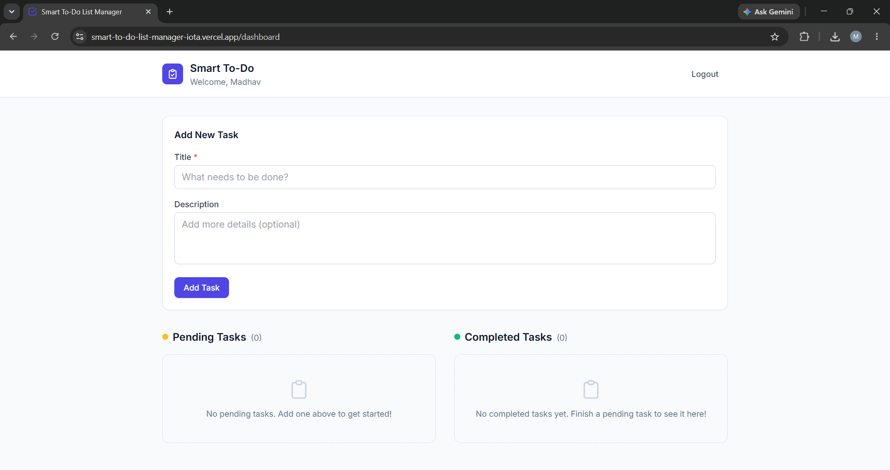
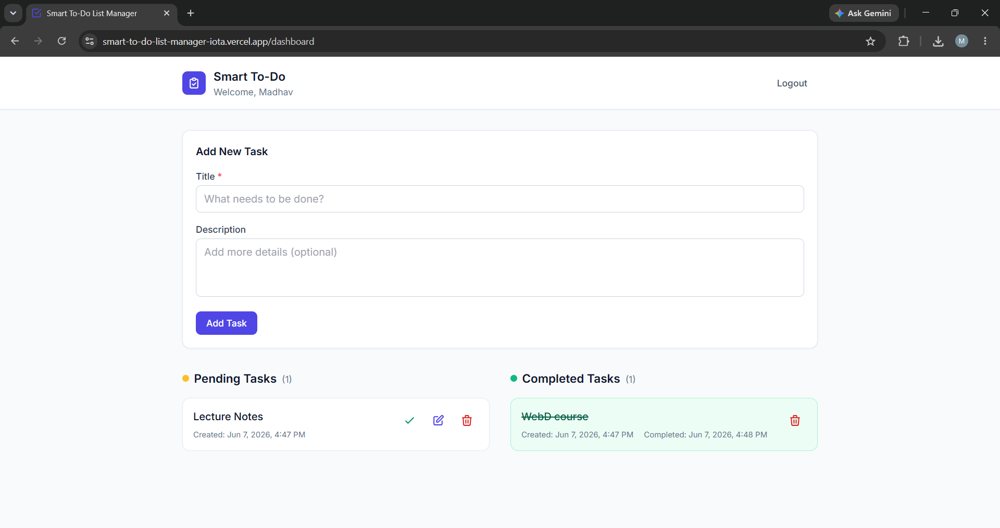

# Smart To-Do List Manager

A full-stack task management application built using React, Node.js, Express, and MongoDB.

## Features

- User login using Name and Email
- Create new tasks
- Mark tasks as completed
- Store task creation and completion timestamps
- Delete tasks
- Responsive UI
- MongoDB Atlas database integration

## Tech Stack

### Frontend
- React
- Vite
- Axios
- CSS

### Backend
- Node.js
- Express.js

### Database
- MongoDB Atlas

### Deployment
- Frontend: Vercel
- Backend: Render

---

## Live Demo

Frontend:
https://smart-to-do-list-manager-iota.vercel.app

Backend:
https://smart-to-do-list-manager.onrender.com

---

## Installation

### Clone Repository

```bash
git clone https://github.com/MadhavSinghal46/Smart-TO-DO-List-Manager.git
```

### Install Dependencies

```bash
npm run install:all
```

### Environment Variables

Create `.env` inside `server` folder:

```env
MONGODB_URI=your_mongodb_connection_string
CLIENT_URL=http://localhost:5173
PORT=5000
```

### Run Project

```bash
npm run dev
```

---

## Screenshots

### Login Page


### Dashboard



### Completed Task



---

## Author

Madhav Singhal